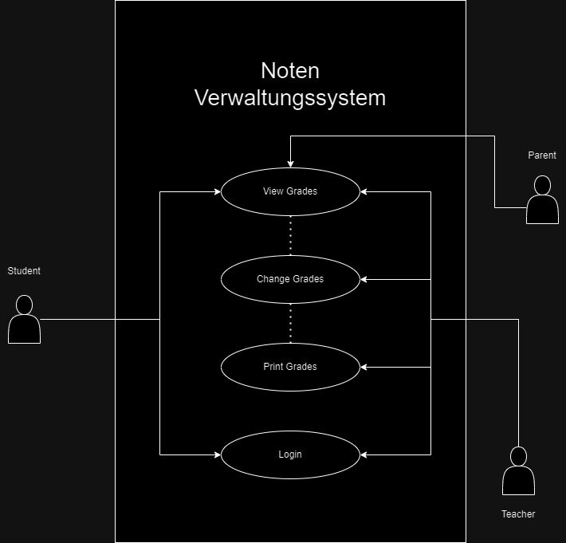

## gradingsystem!

* As a student I want to see my grades, so that I can keep track of my progress.
* As a teacher I want to be able to change grades, so that the system is always updated.
* As a student I want to be able to login so that I am able to see my grades.
* As a parent I want to be able to see my childs' grades so that I am able to see my childs' grade state.
* As a teacher I want to b able to print the report cards so that I can hand them over to the students.

This program is designed to manage and track academic progress for students, teachers, and parents. Students can log in to view their grades and track their progress. Teachers have the ability to update grades to ensure that the system reflects the most current information. Parents can also log in to view their child's grades, helping them stay informed about their child's academic performance. Additionally, teachers can print report cards to distribute to students, providing a physical record of their grades and progress. The system ensures that all users—students, teachers, and parents—can efficiently access the information they need.

